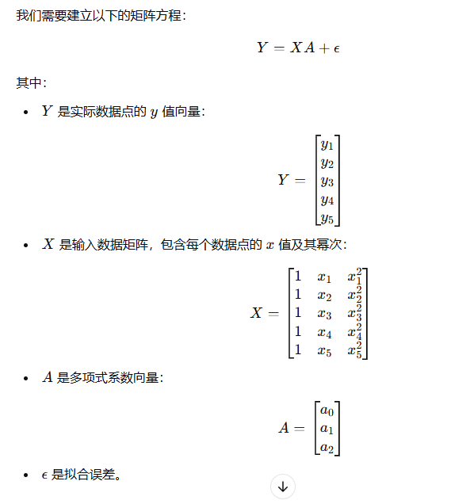
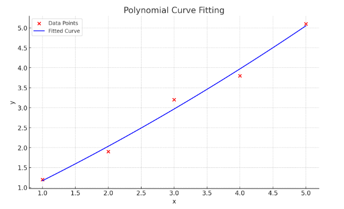
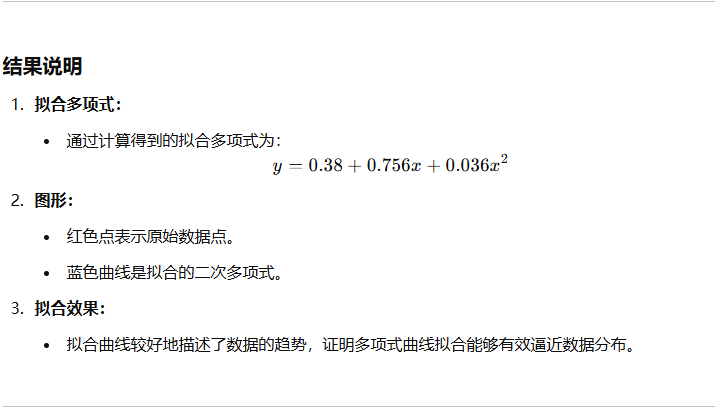

# 多项式曲线拟合执行过程示例

假设我们有一组二维数据点 (𝑥𝑖,𝑦𝑖)，我们的目标是用一个多项式函数来拟合这些数据点，使得拟合曲线能够很好地描述数据的趋势。

## 步骤说明

### 1. 问题描述

假设我们有以下一组数据点：(1,1.2),(2,1.9),(3,3.2),(4,3.8),(5,5.1)
我们想用一个二次多项式 𝑦 = 𝑎0 + 𝑎1𝑥 + 𝑎2𝑥^2 来拟合这些数据。

### 2. 选择多项式模型

我们选择拟合二次多项式：𝑦 = 𝑎0 + 𝑎1𝑥 + 𝑎2𝑥^2

其中：
- 𝑎0，𝑎1，𝑎2 是我们需要确定的系数。
- 目标是找到这些系数，使得拟合曲线与数据点的均方误差（MSE）最小。

### 3. 构建线性方程组（最小二乘法）

###  4. 求解参数 𝐴

### 5. 执行计算

